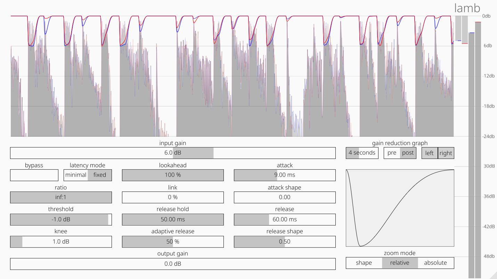

# lamb 🐑

A lookahead compressor/limiter that's soft as a lamb. 

<p align=”center”>
    
</p>

Lamb was made with these goals in mind:

- Be as clean as possible
- Give the user full control over the character with the minimum amount of knobs.

The secret sauce is all in the attack/release:
you can change both the length and the shape of their curve.  
The shapes look like [this](https://www.desmos.com/calculator/cog4ujr7cs); _c0_ in Desmos corresponds to the _shape_ parameters in the plugin.  
When it is at value 0, the curve is a slice of pure sine.  

The ``release hold`` parameter prevents the gain reduction from coming back up if it needs to go down again soon.  
You control how soon is soon with ``release hold``.  
This adds latency though.

## Usage

Apart from regular dragging and using the mousewheel, you can interact with the slider in the following ways:
- Shift + drag or mousewheel: fine adjustments
- Alt + click on a slider: type a value
- Double-click on a slider: back to the default value.


## Building and installing

After installing [Rust](https://rustup.rs/), you can build and install lamb as follows:

```shell
git submodule update --init --recursive
cargo xtask bundle lamb --release
cp -r target/bundled/lamb.vst3 ~/.vst3
```

## User preferences

  **ATTENTION** If you want to use the plugin with a samplerate of more than 48k, make sure you change MaxSampleRate at the start of lamb.dsp.  
  There's a couple of other user preferences as well, documented in the dsp file.

## Rebuilding the Faust dsp

The faust dsp code in ``dsp/lamb.dsp`` is only transpiled to rust if you build with the ``faust-rebuild`` feature activated, like so: 

``` shell
cargo xtask bundle lamb --release  --features faust-rebuild
```

The smoothing algorithm in lamb needs double precision to work.
This only recently [got supported](https://github.com/grame-cncm/faust/commit/9f2eb5766605f9f8235a45965c69ff33b4274685) in faust and is not in a released version yet.
Therefore, you currently need to build faust from source to be able to rebuild the dsp of lamb.  
[Here's](https://github.com/grame-cncm/faust/wiki/BuildingSimple) a quick tutorial on how to do that.


## Thanks

This plugin would not have been possible without the following projects:
- [Faust](http://faust.grame.fr)
- [nih-plug](https://github.com/robbert-vdh/nih-plug)
- [lowpass-lr4-faust-nih-plug](https://codeberg.org/obsoleszenz/lowpass-lr4-faust-nih-plug)

I would like to thank @sletz, @robbert-vdh, @obsoleszenz and @dariosanfilippo for their fantastic support and feedback!   

🐑
