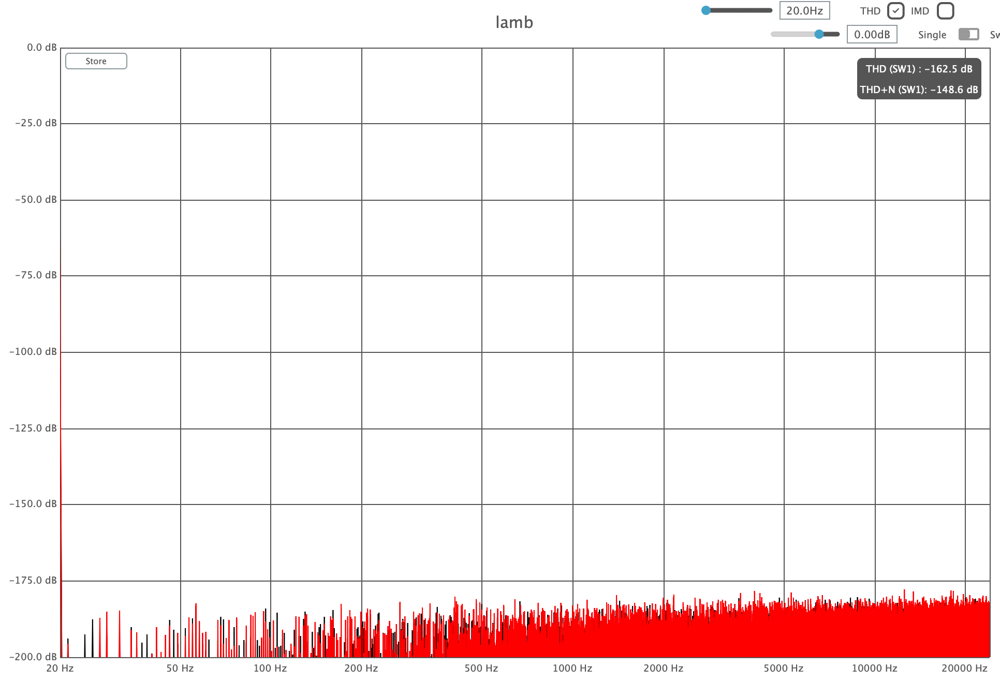

# lamb 🐑

A lookahead compressor/limiter that's soft as a lamb. 

<p align=”center”>
    
</p>

Lamb was made with these goals in mind:
- Be as clean as possible
- Give the user full control over the character with the minimum amount of knobs.

The secret sauce is all in the attack/release:
you can change both the length and the shape of their curve.  
The shapes look like [this](https://www.desmos.com/calculator/iuvx0mrsyi); _t_ in Desmos corresponds to the _shape_ parameter in the plugin.  
When it has the middle value, the curve is a slice of pure sine.  

With the default settings, there is practically zero distortion, even at 20Hz:
<p align=”center”>
    
</p>

## Building

After installing [Rust](https://rustup.rs/) and [Faust](https://faust.grame.fr), you can compile lamb as follows:

```shell
git submodule update --init --recursive
./build.sh
./install.sh
```
🐑
