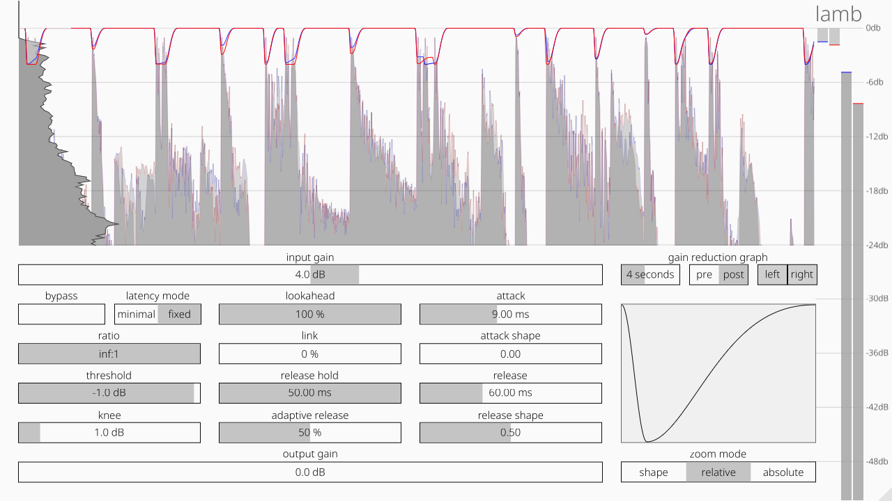

# lamb

A lookahead compressor/limiter that's soft as a lamb. 

<p align=”center”>
    
</p>

The secret sauce is all in the attack/release:
you can change both the length and the shape of their curve.  
The shapes look like [this](https://www.desmos.com/calculator/iuvx0mrsyi); _t_ in Desmos corresponds to the _shape_ parameter in the plugin.  
When it has the middle value, the curve is a slice of pure sine.  

## Building

After installing [Rust](https://rustup.rs/) and [Faust](https://faust.grame.fs), you can compile lamb as follows:

```shell
./build.sh
sudo ./install.sh
```

🐑
